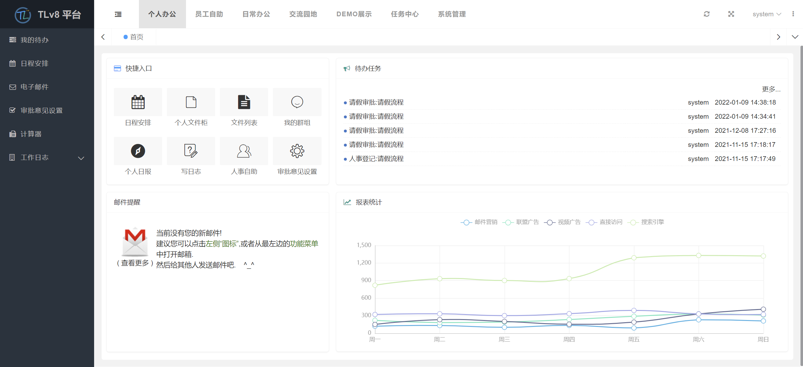
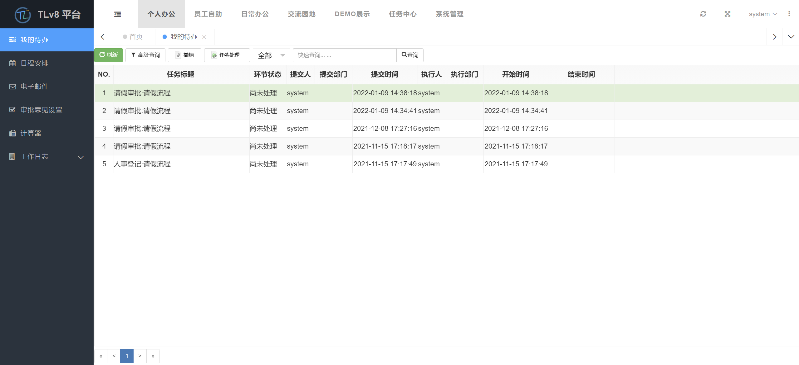
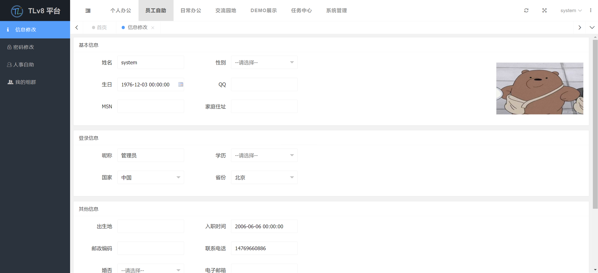
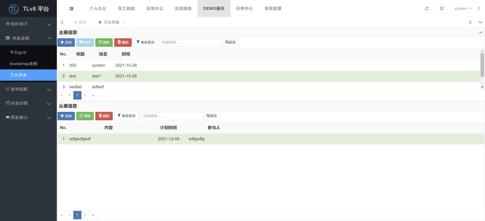
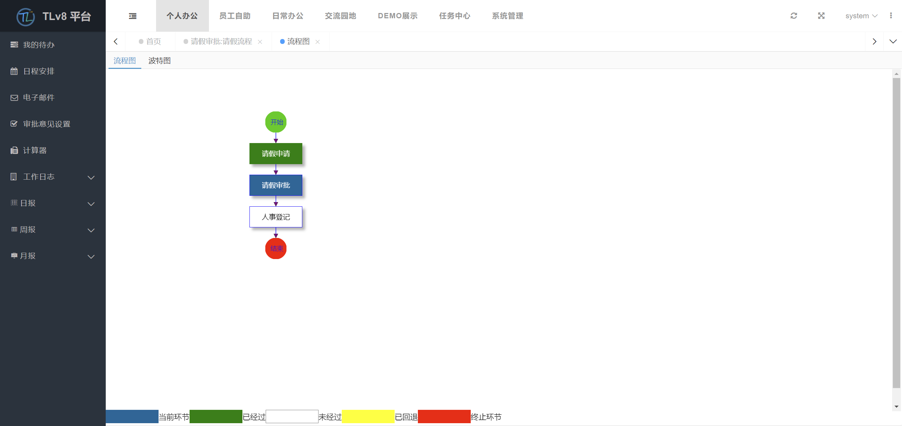
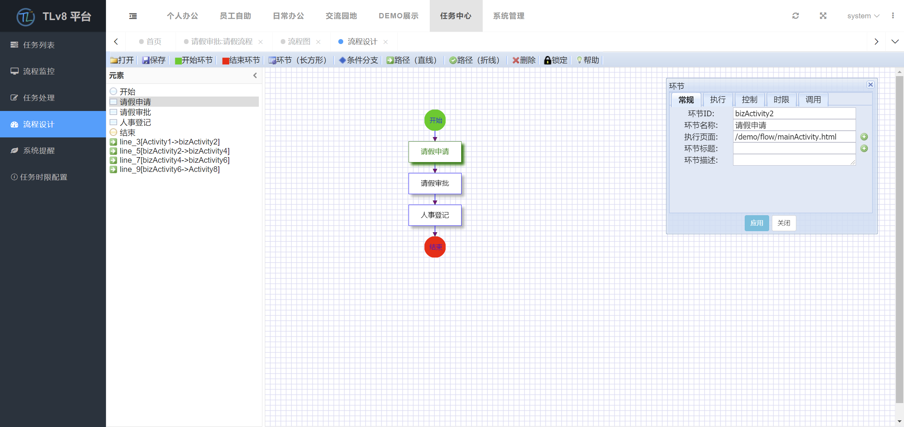

   
   
   

#### 介绍

- 项目集成了工作流引擎、报表引擎和组织机构权限管理后台，可以应用于OA、HR、CRM、PM等系统开发。配合使用[tlv8 ide](https://gitee.com/qianpou/tlv8ide)可以快速实现业务系统开发、测试、部署。
- 后台采用Spring MVC架构简单方便，前端使用流行的[layui](https://gitee.com/sentsin/layui)界面美观大方。

    采用组件开发技术，提高系统的灵活性和可扩展性;采用工作流引擎技术提供系统的快速开发和更新; 实现了业务模型和系统实现技术的分离，从根本上提升管理软件的技术无关性， 能够支持各种主流的操作系统、数据库、基础技术环境。 TLv8是能够满足应用高度集中、业务流程高度复杂、业务需求快速变化的基础架构平台。

产品网站
[www.tlv8.com](https://www.tlv8.com)
帮助文档
[doc.tlv8.com](https://doc.tlv8.com)

#### 软件架构

采用分层来组织系统框架，建议系统分为四层，即“交互层”、“业务逻辑层”、“数据对象层”和“数据库层”。

1.  数据库层：使用数据库进行业务数据的存储，并且利用应用服务器自带的数据库链接池对数据库链接进行管理。
2.  数据对象层：使用相关技术进行对象/关系数据库的映射，实现对数据资源的封装。或通过实现关系数据库的管理接口，实现数据资源的封装。对于业务逻辑层的开发，开发人员只面对业务数据对象或接口，不涉及底层数据库的访问。
3.  业务逻辑层：构建系统模块所需的业务处理方法，交互层将调用业务逻辑层的业务方法来完成业务操作。
4.  交互层：交互层主要负责系统和用户交互部分的实现，包括与用户进行交互的页面及执行操作的请求处理类。

#### 安装教程

1.  获取studio
[tlv8平台下载](https://www.tlv8.com/download)

2.  用户可以使用自己现有的数据库。在现有数据库中执行TLv8平台提供的数据库初始化脚本，运行平台重新配置数据源。

3.  根据现有数据库类型，执行相应初始化脚本，数据库脚本在tlv8.datascript下。

#### 使用说明

1.  项目为eclipse的动态web项目，拉取项目代码后直接导入eclipse即可
2.  业务代码主项目为"tlv8"

    Tomcat外部引用：&lt;Context docBase="../../tlv8-root/tlv8/target/tlv8" path="/tlv8" reloadable="false" workDir="work"/&gt; 
    
    发布运行：tlv8.war

3.  文档服务“DocServer”部署到tomcat下即可运行

    Tomcat外部引用：&lt;Context docBase="../../tlv8-root/DocServer/target/DocServer" path="/DocServer" reloadable="false" workDir="work"/&gt; 

    发布运行：DocServer.war

#### 效果展示

流程展示：

流程设计：

#### 参与贡献

1.  [tulinxian](https://www.tulinxian.com)
2.  [昆明三体科技有限公司](https://gitee.com/kmsanti/dashboard)
3.  [软捷科技](https://www.yunagile.com/)
4.  [layui](https://gitee.com/sentsin/layui)
5.  [layui-mini](https://gitee.com/zhongshaofa/layuimini)

#### 捐赠支持

开源项目不易，若此项目对您有帮助，可以捐赠支持作者持续开发与维护，感谢所有支持开源的朋友！

